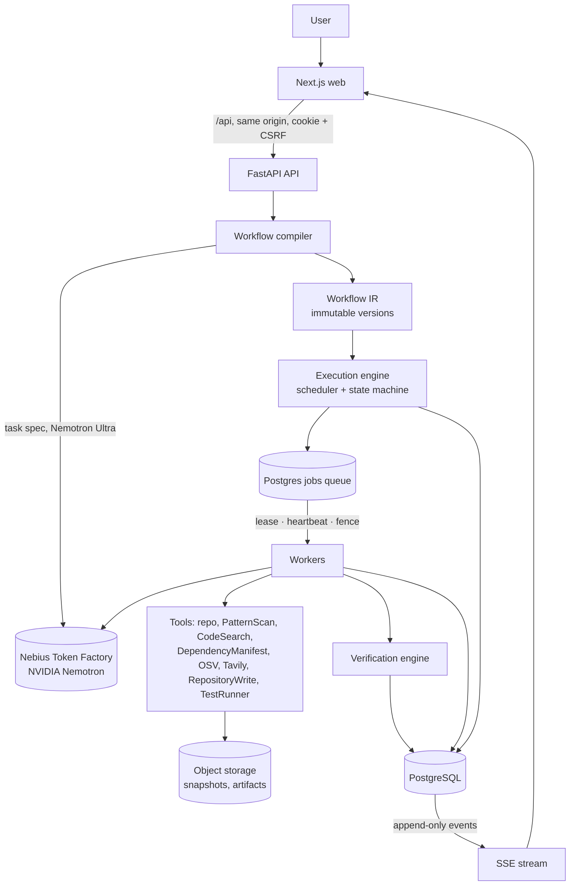

# Architecture

FORGE is a **modular monolith + workers**: one Python codebase serves the API and runs the execution workers; Postgres is the single source of truth *and* the durable queue. Fewer moving parts → fewer partial failures (production reliability over architectural complexity).

## Modules (backend/forge)

| Module | Responsibility |
|---|---|
| `api/` | HTTP: auth, workspaces, projects, repositories, workflows, runs, approvals, artifacts, evaluations, system, settings |
| `deps.py`, `security.py`, `ratelimit.py`, `audit.py` | Sessions, CSRF, server-derived workspace scope, Postgres rate limits, audit log |
| `workflow/ir.py` | Canonical Workflow IR (Pydantic, strict, serialisable, content-hashed) |
| `workflow/validate.py` | Static validation: cycles, unreachable nodes, missing inputs, invalid mappings, unknown tools, permission conflicts, impossible dependencies, write-without-approval |
| `workflow/state.py` | Node and run state machines; every transition is checked |
| `workflow/router.py` | Explainable model routing (nano/super/ultra) with fallback |
| `workflow/budget.py`, `retry.py` | Budget decisions; error classification + retry/backoff/jitter/fallback |
| `compiler.py` | Goal → Nemotron task spec → deterministic typed DAG → validation (+1 repair round) |
| `engine/core.py` | Scheduler, input assembly (typed handoffs), transitions + checkpoints + events, run lifecycle, controls |
| `engine/readiness.py` | Pure readiness rules (fan-out/join, condition branches, failure edges, recovery) |
| `engine/worker.py` | Leasing, heartbeats, lease reaping, fenced completion, outcome handlers |
| `engine/agent_runner.py` | Resumable, policy-checked tool loop over structured model output |
| `engine/executors.py` | Semantics of PARALLEL, JOIN, CONDITION, RETRY, APPROVAL, VERIFICATION, RECOVERY, TRANSFORM |
| `engine/llm.py` | The only place model calls happen: reserve budget → call → settle → record |
| `verification.py` | Evidence-based verification of claims |
| `policy.py`, `registry/` | Capability checks; agent and tool registries |
| `tools/`, `sandbox.py`, `repos.py` | Tool implementations, filesystem sandbox, repository import |
| `storage.py`, `artifacts.py` | S3/local object store; content-hashed artifacts with provenance |
| `summary.py` | Read-side aggregation (totals, honest cost basis, metrics) |
| `engine/retention.py` | Configurable data retention sweeper |

## Execution model

1. **Create run** (API, one transaction): freeze the approved IR into `runs.ir_snapshot`, create one `run_nodes` row per node, `schedule()`.
2. **Schedule** (always under `SELECT … FOR UPDATE` on the run): evaluate every PENDING node with `readiness.evaluate`; READY nodes get their typed input assembled and validated (`HANDOFF_VALIDATED` / `HANDOFF_FAILED`) and a job enqueued (a partial unique index forbids two live jobs per node).
3. **Lease** (worker): `UPDATE … WHERE id = (SELECT … FOR UPDATE SKIP LOCKED)` honouring per-workspace and per-run concurrency.
4. **Begin**: re-check run state (cancel/pause), node RUNNING, build the node context.
5. **Execute** outside any transaction (minutes): every model call reserves budget first; every tool call is authorised first; each agent step is checkpointed.
6. **Finish**: first *fence* (`UPDATE jobs SET status='done' WHERE id=… AND leased_by=me AND status='leased'`), so a worker that lost its lease writes nothing; then persist artifacts, transition, `schedule()`.
7. **Recover**: a heartbeat thread renews leases; the reaper requeues expired leases (RUNNING → READY) and the agent resumes from its last step checkpoint. Successful nodes are never re-run.

## Real-time

Events are an append-only table (trigger-enforced) whose bigint id is the SSE cursor. `GET /api/runs/{id}/stream` tails it server-side and supports `Last-Event-ID` resume. The browser refetches the run snapshot (debounced) on each event: the UI shows server truth, never a client reconstruction.

## Why Postgres as the queue

Atomic "state change + enqueue" in one transaction, crash-safe leases, no second system to operate or keep consistent. Throughput needs here are tens of jobs per second, far below Postgres' limits. The trade-off is documented in OPERATIONS.md (scale beyond ~100 concurrent workers → partition `jobs` or move dispatch to a broker; the engine API wouldn't change).
